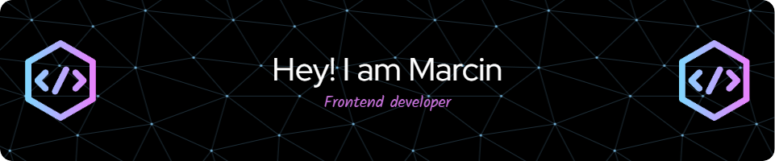

<!-- <h1 style="">Hi 👋, I'm Marcin</h1> -->
<!-- 
A passionate frontend developer from 2021
 -->

# 💻 Tech Stack:

                             

<picture>
  <source media="(prefers-color-scheme: dark)" srcset="https://raw.githubusercontent.com/Tryt4n/Tryt4n/output/github-snake-dark.svg" />
  <source media="(prefers-color-scheme: light)" srcset="https://raw.githubusercontent.com/Tryt4n/Tryt4n/output/github-snake.svg" />
  
</picture>
